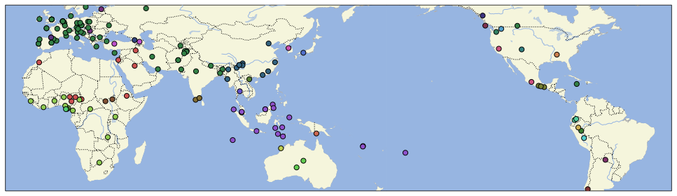

# CLDF dataset with phoneme inventories from the "Journal of the IPA", aggregated by Baird et al. (2021)

## How to cite

If you use these data please cite
- the original source
  > Baird, L., Evans, N., & Greenhill, S. J. (2021). Blowing in the wind: Using 'North Wind and the Sun' texts to sample phoneme inventories. Journal of the International Phonetic Association, 1–42. doi:10.1017/s002510032000033x
- the derived dataset using the DOI of the [particular released version](../../releases/) you were using

## Description

This dataset is licensed under a CC0-1.0 license

Available online at https://doi.org/10.1017/S002510032000033x

Languages representd in the dataset color-coded by language family.

## CLDF Datasets

The following CLDF datasets are available in [cldf](cldf):

- CLDF [StructureDataset](https://github.com/cldf/cldf/tree/master/modules/StructureDataset) at [cldf/StructureDataset-metadata.json](cldf/StructureDataset-metadata.json)